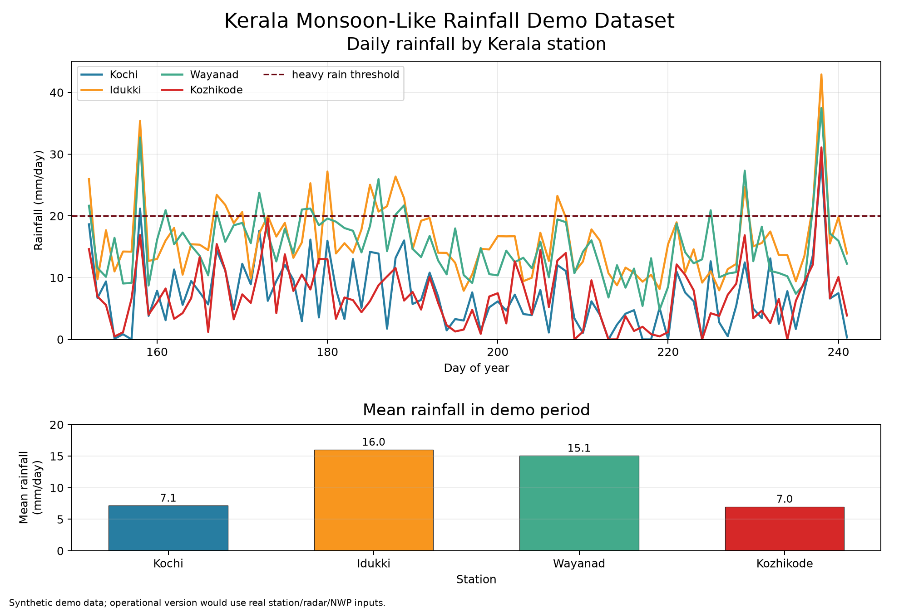
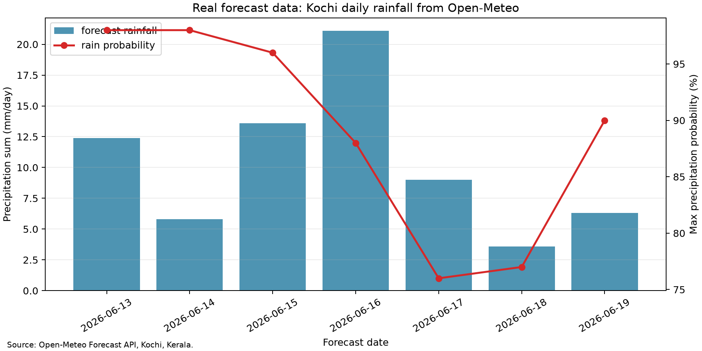
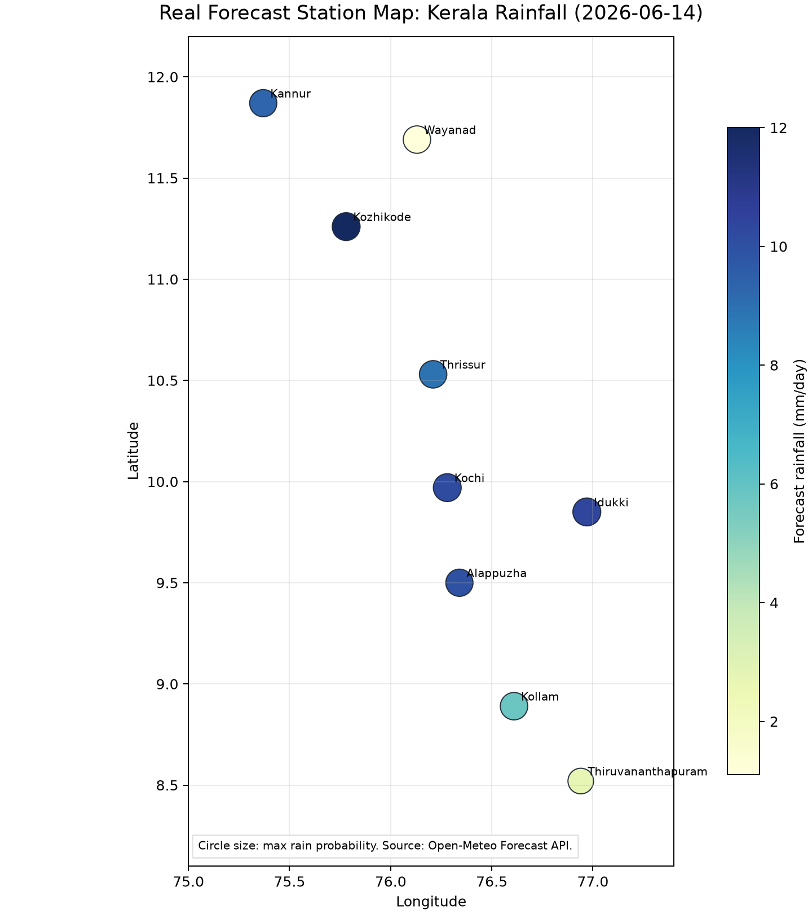
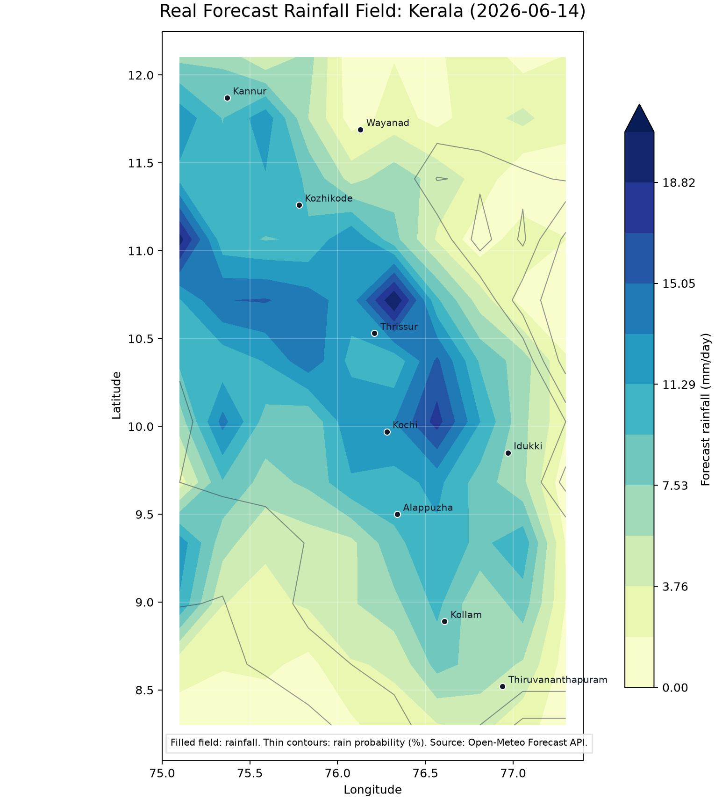

# Kerala Rainfall Forecast Postprocessing Prototype
This repository demonstrates how to structure a practical ML workflow for improving local rainfall forecasts in **Kerala, India**, a South Asian monsoon region. It is a compact prototype, not an operational weather service. The included demo data are simulated but shaped like meteorological station/NWP data.

## What The Prototype Does

1. Builds a Kerala monsoon-like demo dataset.
2. Converts meteorological variables into ML features.
3. Trains a small PyTorch model to postprocess raw NWP rainfall into local rainfall estimates.
4. Evaluates overall error and heavy-rain detection metrics.
5. Serves a `/predict` API for Kerala stations such as Kochi, Idukki, Wayanad, and Kozhikode.

## Repository Structure

```text
.
├── src/meteo_ml/
│   ├── kerala.py       # Kerala stations and metadata
│   ├── data.py         # xarray demo dataset and netCDF-ready loader
│   ├── features.py     # Feature extraction and standardization
│   ├── model.py        # PyTorch precipitation postprocessing model
│   ├── evaluate.py     # MAE/RMSE and heavy-rain metrics
│   ├── train.py        # Training and model artifact export
│   └── serve.py        # FastAPI inference service
├── tests/
│   └── test_pipeline.py
├── docs/
│   └── workflow.md     # Step-by-step explanation
├── .github/workflows/ci.yml
├── Dockerfile
├── pyproject.toml
└── requirements.txt
```

## Quick Start

```bash
python3 -m venv .venv
source .venv/bin/activate
python3 -m pip install --upgrade pip
python3 -m pip install -r requirements.txt
python3 -m pip install -e .
python3 -m pytest -o cache_dir=/tmp/meteo-ml-pytest-cache
python3 -m meteo_ml.train --epochs 100
python3 scripts/plot_kerala_demo.py
python3 scripts/plot_real_open_meteo_kochi.py
python3 scripts/plot_real_open_meteo_station_map.py
python3 scripts/plot_real_open_meteo_field_map.py
uvicorn meteo_ml.serve:app --reload
```
The server keeps running until stopped with `CTRL+C`.

Open the interactive API documentation and test page:

```text
http://127.0.0.1:8000/docs
```

Example inference request:

```bash
curl -X POST http://127.0.0.1:8000/predict \
  -H "Content-Type: application/json" \
  -d '{
    "station": "Kochi",
    "day_of_year": 180,
    "temperature": 298.0,
    "humidity": 0.86,
    "pressure": 1004.0,
    "wind_u": -5.0,
    "wind_v": 1.5,
    "nwp_precipitation": 28.0
  }'
```

Example response:

```json
{
  "station": "Kochi",
  "district": "Ernakulam",
  "precipitation_mm": 24.7,
  "heavy_rain_risk": "heavy",
  "model_version": "kerala-prototype-0.2.0"
}
```
Example training output:

```text
mae_mm=1.919 rmse_mm=2.396 heavy_rain_recall=0.667
```

## Figures

The repository includes two plotting scripts:

```bash
python3 scripts/plot_kerala_demo.py
python3 scripts/plot_real_open_meteo_kochi.py
python3 scripts/plot_real_open_meteo_station_map.py
python3 scripts/plot_real_open_meteo_field_map.py
```

The first figure visualizes the simulated Kerala monsoon-like dataset used for the reproducible ML pipeline:



The second figure uses **real forecast data** from the Open-Meteo Forecast API for Kochi, Kerala. It shows daily precipitation sum and precipitation probability:



The third figure is a station forecast map using real Open-Meteo forecast data for multiple Kerala stations. Color shows forecast rainfall and circle size shows rain probability:



The fourth figure is a gridded weather-field style rainfall map for Kerala. It samples real Open-Meteo forecast data over a small latitude/longitude grid, shades forecast rainfall, and overlays station locations:



The simulated plot is useful for reproducible testing; the real-data plot shows how the repository can connect to live meteorological data without requiring a large GRIB/netCDF download.


Small note: this command works, but a more readable Docker version is:

```bash
docker build -t kerala-rainfall-prototype .
docker run -p 8000:8000 kerala-rainfall-prototype

## Real-Data Extension

The ML pipeline uses simulated demo data so the project can run easily and reproducibly. We also include a live Open-Meteo forecast plot for Kochi to show how real weather data can enter the workflow. In a next step, the demo data could be replaced with GFS GRIB2 forecasts and CHIRPS, IMERG, or station rainfall observations.